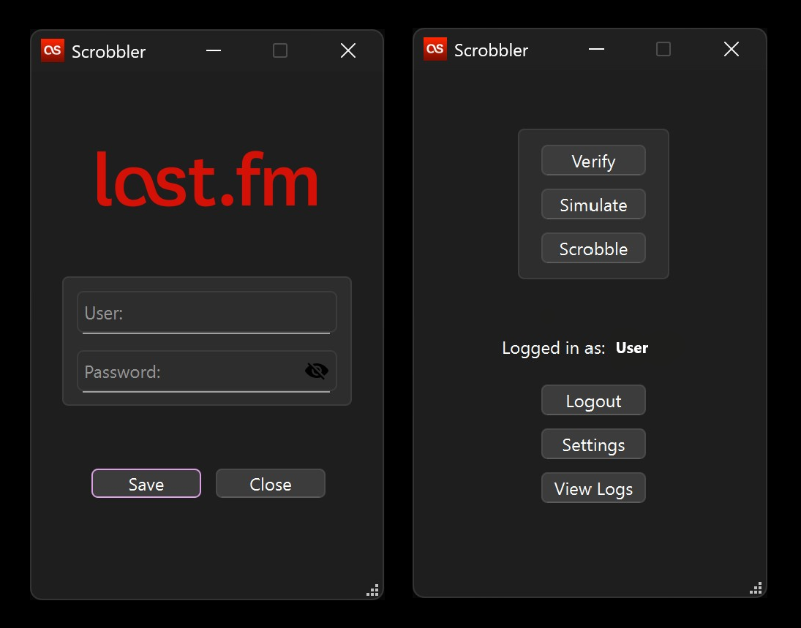

# Scrobbler

Desktop software to upload iPod log data to **last.fm**. Specifically designed for integration with the iPod 5th Generation.

> Disclaimer: This is an older project of mine, made over the course of a weekend.

  

